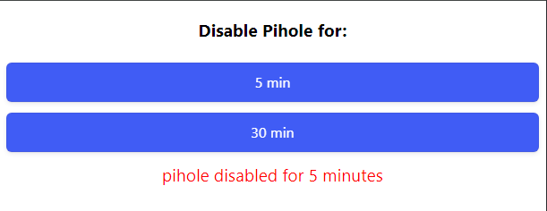

# pihole-disable

The simple solution to temporarily disable pihole from your network! 
  
(Perfect for family members that complain about links not working for time to time!) 

## Installation
> [!NOTE]  
> The author installed this on Debian 12. Requires [pihole-web](https://github.com/pi-hole/web) > *which is installed by default with pihole* to work. 

on the pihole host:
```sh
# clone the project (requires git)
cd /var/www/html
git clone https://github.com/elprice/pihole-disable.git disable

# disable piholes default redirect rule of all non-/admin/ URLs to /admin/ by renaming it. 
#  Don't worry - this behavior is retained in the included pihole-disable config.
cd /etc/lighttpd/conf-enabled
mv 16-pihole-admin-redirect.conf 16-pihole-admin-redirect.conf.old

# move the pihole-disable config to lighttpd dir 
mv /var/www/html/disable/17-pihole-disable.conf 17-pihole-disable.conf

# restart lighttpd
systemctl reload lighttpd
```

## Usage
pihile-disable should be available @ http://\<your-pihole-url\>/disable/

Click the buttons to disable pihole temporarily!

> [!TIP] 
> If a different path than http://\<your-pihole-url\>/disable/ is desired just clone the project to a different directory name under /var/www/html and update the 17-pihole-disable.conf 'disable' references to the new directory name
